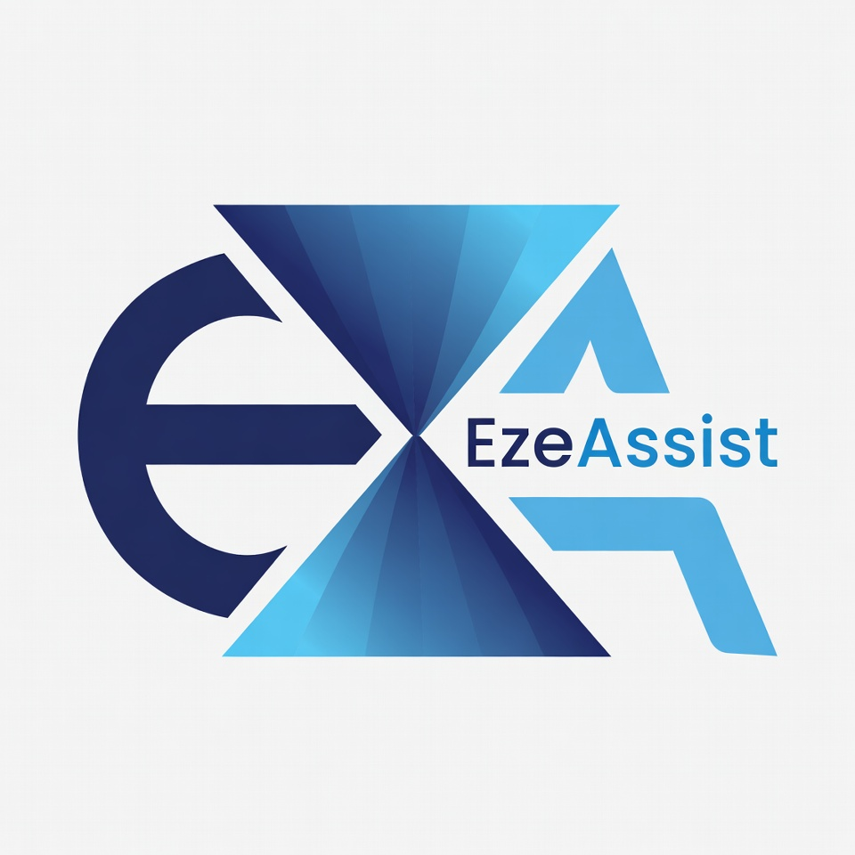

# EzeAssist – AI Study Copilot

EzeAssist is an AI-powered study assistant that helps you summarize notes, improve writing clarity, and generate flashcards and quiz questions from your content.



## Features

- **Text summarization** – Condense long passages into concise summaries.
- **Text rewriting** – Improve grammar, style, and clarity of your writing.
- **Flashcards** – Generate Q&A flashcards from your notes.
- **Quiz questions** – Create quiz questions from study material.
- **Bullet points** – Convert text into structured bullet-point outlines.

## Tech stack

- **Backend:** Python, FastAPI  
- **AI:** [Groq](https://groq.com) API (Llama)  
- **Frontend:** React  
- **API:** REST  

## Getting started

### Prerequisites

- Python 3.10+
- Node.js and npm
- [Groq](https://console.groq.com) API key

### Installation

**1. Clone the repository**

```bash
git clone https://github.com/mieze221/EzeAssist.git
cd EzeAssist
```

**2. Backend**

```bash
cd backend
python -m venv .venv
source .venv/bin/activate   # Windows: .venv\Scripts\activate
pip install -r requirements.txt
cp .env.example .env
```

Add your Groq API key to `.env`:

```
GROQ_API_KEY=your_groq_api_key_here
```

Run the server:

```bash
uvicorn main:app --reload --host 127.0.0.1 --port 8000
```

API docs: http://127.0.0.1:8000/docs

**3. Frontend**

```bash
cd ../frontend
npm install
npm start
```

Open http://localhost:3000

### Example API request

```bash
curl -X POST http://127.0.0.1:8000/process \
  -H "Content-Type: application/json" \
  -d '{"text":"Your notes or text here.","task":"summarize"}'
```

Supported `task` values: `summarize`, `rewrite`, `flashcards`, `quiz`, `bullets`.

## Folder structure

```
EzeAssist/
├── backend/
│   ├── main.py          # FastAPI app and Groq integration
│   ├── requirements.txt
│   └── .env.example
├── frontend/
│   ├── public/
│   │   └── logo.png
│   ├── src/
│   │   ├── App.js
│   │   └── App.css
│   └── package.json
└── README.md
```

## License

This project is open-source under the MIT License.
